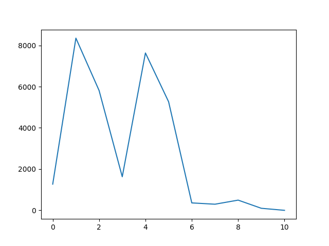

# Mirrnum
> The Peculiar Effect Of Substracting Mirrored Numbers.  



## What are you talking about?
> Take any number (preferably with multiple digits).
> Subtract this number with it's mirror, like this:
```python
3412 - 2143
``` 
> This will give you `1269`.  
> ( If you end up getting a negative number as a result, 
> the rule is to convert it to an unsigned number )  
> Now keep doing this with the result and you will always get a sequence
> of numbers, that eventually ends up at a number divisible by `9`, 
> before finally collapsing to `0`.  
> For example, the subtraction above (`3412 - 2143`) will give you the
> following sequence:
```
[1269, 8352, 5814, 1629, 7632, 5265, 360, 297, 495, 99, 0]
```
> There is *ONE* exception however, if you do this with the number `2178`,
> you will end up in an infinite loop because the result will eventually become
> `2178` once again.
